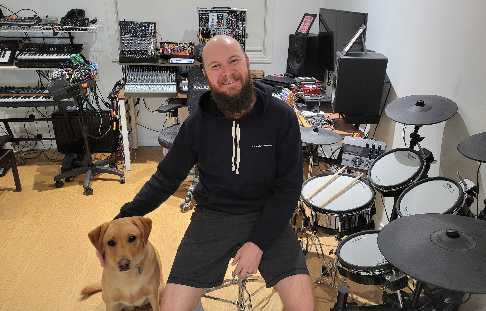
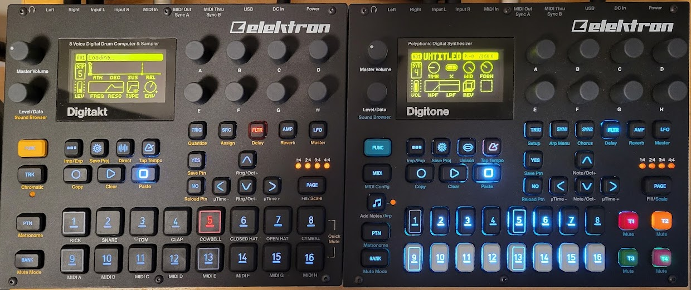

## JAMStack Conf 2021 - "Synthless" Jams with your friends 
> aka WebMIDIRTC 

---

## about me 

Sr. DevRel Engineer @ Daily

@philmillman

----

working remotely from Hamilton, ON, Canada 

----

recovering musician 

---

## How it started


----

## How it's going 




---

## How it started


----

## How it's going 

<button id="start-call" onclick="startCall()">Start Call</button>
<button id="end-call" onclick="endCall()">End Call</button>

---

## How it started


----


----


----

## How it's going 

[HTML5 Drum Machine](https://html5drummachine.com/virtual-drum-machine/)

----

[Bandlab](https://www.bandlab.com/mix-editor)

----

[Ludotune](https://ludotune.com/)

---


---

## How it started


----


----


----

## How it's going


---

Let's put all of this together <br> and create something awesome

---

## The stack

----

## ... for jamming

---

App 

- Vue
- created via `vue-cli` 
- adapted from older project


---

Video

[](https://webrtcforthecurious.com/docs/01-what-why-and-how/)


----


----


<figure class="video_container">
  <video controls="false" loop="true" allowfullscreen="true" poster="path/to/poster_image.png">
    <source src="https://daily-web.s3.us-west-2.amazonaws.com/www-daily-co/web-assets/videos/prebuiltHeroVideo.mp4" type="video/mp4">
  </video>
</figure>

----

```html
<script src="https://unpkg.com/@daily-co/daily-js"></script>
<script>
  callFrame = window.DailyIframe.createFrame();
  callFrame.join({ url: 'https://you.daily.co/hello' });
</script>
```

---

MIDI

----

<picture>
<source type="image/webp" srcset="https://caniuse.bitsofco.de/static/v1/midi-1632878905307.webp">
<source type="image/png" srcset="https://caniuse.bitsofco.de/static/v1/midi-1632878905307.png">

</picture>

----


---

Hardware 



----

## Digitakt 

- Drum "computer" 
- Sampler
- MIDI Sequencer

----

## Digitone

- "Modern" FM synth
- MIDI Sequencer 

----

## TL;DR 

🥁 + 🎹

---

Quick app preview [🔎](http://localhost:8080/)

---

Now a quick code tour 👨‍💻

---


---

# what next!? 

----

more MIDI 


----

more devices 


----

more collaboration 

- remote sampling
- remote MIDI input/control
- remote looping 

----

more control

- participant roles
- MIDI command queuing 

----

more features

- recording
- live streaming
- fully custom call UI 

---

## Acknowledgements 

----

inspiration

- Github Noops
- Thomann Stompenberg 

----

## thanks

- open source 
  - Vue, WebMidi.js
- Daily
- Netlify, and JAMStack Conf team

---


